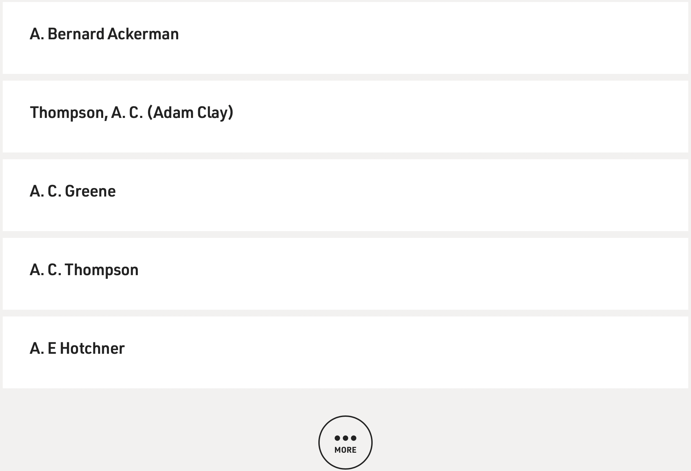

# Overview

Fresh Air is an NPR program that has been running continuously since 1975. The archive makes the relatively incontrovertible claim that thousands of guests 
have been interviewed so far. Quickly scanning the guest list to find a set of audio interviews to listen to is not easy on the site however.
The content on the web page is dynamic and uses a JavaScript button that only displays a handful of results for every "more" button press.

One way to see all or most of the guests on the program in one place is to browse and then parse the sitemap. Every guest who has been on the show has the
string 'guest' in the URL because that is how the archive site arranges content. There are also duplicates that arise parsing in this way. Scrapy is a Python
module that has a Sitemap Spider that can crawl links based on such a condition to get a large list of URLs that hopefully contains every guest who has been
interviewd on Fresh Air.

In addition to the Sitemap Spider Scrapy has a feature called Shell mode. This provides an interactive way to extract html information using CSS or XPATH 
selectors. This can be helpful for beginners to scraping who are unfamiliar with the terms, workflow and procedures of scraping a site. With a for loop
and a few internal Python modules like CSV and RE it is possible to get the exact same output using Scrapy Shell that can be scraped with the aforementioned
Sitemap Spider.

